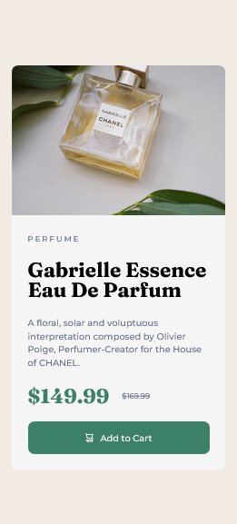

Design of a responsive product card with semantic HTML5 and CSS3. No frameworks or libraries were used.

This is a solution to the [Product preview card component challenge on Frontend Mentor](https://www.frontendmentor.io/challenges/product-preview-card-component-GO7UmttRfa). Frontend Mentor challenges help you improve your coding skills by building realistic projects. 

## Table of contents

- [Overview](#overview)
  - [The challenge](#the-challenge)
  - [Screenshot](#screenshot)
  - [Links](#links)
- [My process](#my-process)
  - [Built with](#built-with)
  - [What I learned](#what-i-learned)
- [Author](#author)

## Overview

### The challenge

Users should be able to:

- View the optimal layout depending on their device's screen size
- See hover and focus states for interactive elements

### Screenshot

- Desktop view

- Mobile view

### Links

- Solution URL: [GitHub](https://github.com/JosephOluOlofinte/product-card)
- Live Site URL: [Product Preview Card](https://josepholuolofinte.github.io/product-card/)

## My process

### Built with

- Semantic HTML5 markup
- CSS3 custom properties
- Flexbox
- CSS Grid

### What I learned

I didn't really learn anything new here, but it did help me practice with more purpose and focus.

## Author

- LinkedIn - [Joseph Olu Olofinte](https://www.linkedin.com/in/joseph-olu/)
- Frontend Mentor - [@JosephOluOlofinte](https://www.frontendmentor.io/profile/JosephOluOlofinte)
- Twitter - [@josepholofinte](https://www.twitter.com/josepholofinte)
